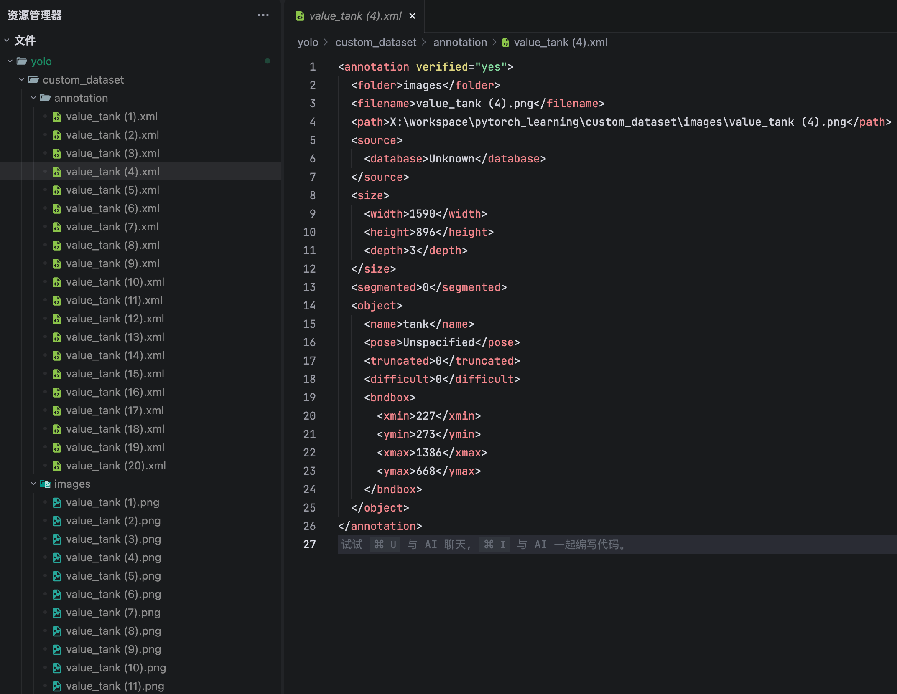

# 目标检测实战教程

目标检测是计算机视觉中的一个重要任务，它的目标是在图像中识别并定位出感兴趣的对象。

目标检测器的输出是一组边界框，这些边界框包围了图像中的目标，以及每个框的类别标签和置信度分数。当您需要在场景中识别感兴趣的目标，但不需要确切知道目标在哪里或其确切形状时，目标检测是一个不错的选择。

---


## 1. YOLO 模型

### 1.1. YOLO 简介和安装

在目标检测领域，YOLO (You Only Look Once) 一直是速度和精度的代名词。
到了 2026 年，YOLOv26 带来了几个革命性的改进，非常适合我们初学者：

1.  **端到端 (End-to-End)**：以前的 YOLO 需要一个叫 "NMS" 的复杂后处理步骤来去除重复的框，现在 YOLOv26 直接输出最终结果，速度更快，代码更简单！
2.  **MuSGD 优化器**：这是一种结合了 SGD 和 Muon 的新型优化器，让模型训练收敛更快，就像给汽车换了更高级的引擎。
3.  **CPU 友好**：官方宣称 CPU 推理速度提升了 43%，这对我们使用 Mac (尤其是没有独立显卡) 的同学来说是巨大的福音。

---


尽管是 2026 年的最新模型，YOLOv26 依然保持了极好的兼容性，集成在 `ultralytics` 库中。

在终端中运行以下命令：

```bash
# 安装 ultralytics 库 (确保更新到支持 YOLOv26 的最新版本)
pip install ultralytics --upgrade

# 安装 opencv 用于图像处理
pip install opencv-python
```

---

### 1.2. 快速体验：你的第一次检测

我们直接加载官方预训练好的 **YOLOv26 Nano** 模型 (`yolo26n.pt`)。这是最小、最快的版本。

打开或新建 `quick_start.py`，输入以下代码：

```python
from ultralytics import YOLO

# 1. 加载模型
# 'yolov26n.pt' 是 2026 年最新的 nano 版本模型
# 'n' 代表 nano，体积最小，速度最快
# 第一次运行时，系统会自动从云端下载这个模型文件
model = YOLO('yolo26n.pt')
# 2. 进行预测
# source: 图片来源，可以是本地路径，也可以是 URL
# 我们依然用经典的巴士图来测试
model.predict(source='https://ultralytics.com/images/bus.jpg', save=True)
```

**运行结果：**
你会在 `runs/detect/predict` 目录下看到结果。

当然，你也可以通过 `save_dir` 参数指定保存目录。

```python
model.predict(source='https://ultralytics.com/images/bus.jpg', save=True, save_dir='images')
```

**运行结果：**
你会在 `images` 目录下看到结果。

---

## 2. 实战：训练自己的数据集

假设我们要训练一个模型来检测 三角洲行动 中的 **“大红-坦克”** 。我们应该怎么去做呢？

### 2.1 目标检测数据集介绍

业界常用于进行目标检测的数据集格式有 COCO、 VOC、YOLO 等，它们的数据格式各有千秋。不过唯一相同的是，他们都是以一个矩形框的形式来标注目标的。

- **[COCO](https://cocodataset.org/#download)**：COCO 是一个常用的数据集，包含 80 个类别，是目标检测领域的基准数据集。

coco 针对于每一个对象的标注格式是只标注**矩形框的左上角坐标 + 矩形框的宽高。**

    ```text
    coco/
    ├── annotations/
    │   ├── instances_train2017.json
    │   └── instances_val2017.json
    ├── train2017/
    │   ├── 000000000009.jpg
    │   └── ...
    └── val2017/
        ├── 000000000139.jpg
        └── ...
    ```


- **VOC**：VOC 是另一个常用的数据集，包含 20 个类别，也是目标检测领域的基准数据集。

voc 针对于每一个对象的标注格式是只标注**矩形框的左上角坐标 + 右下角坐标**

    ```text
    voc/
    ├── annotations/
    │   ├── train/
    │   └── val/
    ├── images/
    │   ├── train/
    │   └── val/
    ```

- **[YOLO](https://docs.ultralytics.com/zh/quickstart/)**：YOLO 数据集格式是比较简洁的，每个图片对应一个文本文件（`*.txt`），文件中包含了所有的标注信息。

yolo 针对于每一个对象的标注格式是只标注**矩形框的中心点坐标 + 矩形框的宽高**，且每个坐标都归一化到 [0, 1] 之间。

即：
- 矩形框的中心点坐标 = (x_center / img_width, y_center / img_height)
- 矩形框的宽高 = (width / img_width, height / img_height)

所有的坐标值都归一化到 [0, 1] 之间，这是 YOLO 数据集的一个标准要求。


结构如下：
```text
datasets/
└── pikachu_data/
    ├── images/
    │   ├── train/  # 训练图片
    │   └── val/    # 验证图片
    └── labels/
        ├── train/  # 训练标签
        └── val/    # 验证标签
```

### 2.2. 图片标注

本文在图片标注上使用的是 **LabelImg** 工具。这是最经典、最适合新手的开源标注工具。它的优点是**轻量级、不用联网、免费**，而且**原生支持**导出你需要的 **PascalVOC** (`.xml`) 和 **YOLO** (`.txt`) 格式，非常方便。

 📖 LabelImg 保姆级使用教程

启动软件后，请按照以下步骤操作：

**第一步：加载图片**
*   点击左侧的 **"Open Dir"** 按钮，选择存放图片的文件夹。
*   点击 **"Change Save Dir"** 按钮，选择一个文件夹用来存放生成的标签文件（建议新建一个 `labels` 文件夹，保持整洁）。

**第二步：切换格式（最重要的一步！）**
*   在左侧工具栏，你会看到一个按钮，默认显示 **"PascalVOC"**。
    *   如果你需要 **VOC** 格式（生成 `.xml` 文件），保持默认即可。
    *   如果你需要 **YOLO** 格式（生成 `.txt` 文件），**点击一下这个按钮**，它会变成 **"YOLO"**。

**第三步：开始标注**
*   按快捷键 **`W`**：进入画框模式，鼠标变成十字，在目标物体上拉一个框。
*   输入标签：画好框后，会弹窗让你输入类别名称（比如 `dog`, `cat`）。
*   点击 **"OK"** 确认。

**第四步：保存与切换**
*   按 **`Ctrl + S`** (Mac 上是 `Command + S`) 保存当前图片的标签。
*   按 **`D`**：切换到**下一张**图片。
*   按 **`A`**：切换到**上一张**图片。

**💡 小贴士：**
*   **自动保存**：点击菜单栏的 `View` -> 勾选 `Auto Save mode`，这样切换图片时会自动保存，不用每次都按保存键，效率翻倍！
*   **classes.txt**：当你选择 YOLO 格式时，软件会自动在保存目录下生成一个 `classes.txt` 文件，里面记录了所有的类别名称。**千万不要删掉它**，训练的时候需要用到。

### 2.3. 数据集准备

我们需要自己准备一个数据集，包含训练图片和对应的标注文件。

本文一开始使用 labelImg 标注了 20 张图片，最终输出了一个 VOC 格式的数据集，如下图所示。



有了数据集后，我们需要考虑数据集的格式。YOLO 并不能直接支持 VOC 格式，我们需要将其转换为 YOLO 格式。

我们可以通过一个脚本进行转换，脚本主要做以下几件事：

1. **接收输入参数** ：
    - `annotations_dir` : 存放原始 XML 文件的文件夹路径。
    - `labels_dir` : 转换后 TXT 文件要保存的文件夹路径。
    - `classes` : 一个列表，包含所有类别的名称（例如 `['cat', 'dog']` ）。YOLO 需要数字 ID，我们需要用这个列表来查找名字对应的数字索引。

2. **获取图片标注信息**：读取并解析每个 XML 文件，提取图片尺寸和所有标注框的信息。
3. **坐标转化**：将 图片尺寸 和 标注点坐标 转换为 YOLO 格式，并保存到 `labels_dir` 目录下。

```python
def convert_voc_to_yolo(annotations_dir, labels_dir, classes):
    """
    将 VOC XML 格式的标注转换为 YOLO TXT 格式
    """
    if not os.path.exists(labels_dir):
        os.makedirs(labels_dir)

    print(f"正在将标注从 {annotations_dir} 转换为 YOLO 格式并保存到 {labels_dir}...")

    # 获取所有 XML 文件
    xml_files = [f for f in os.listdir(annotations_dir) if f.endswith(".xml")]

    for xml_file in xml_files:
        xml_path = os.path.join(annotations_dir, xml_file)

        with open(xml_path, "r", encoding="utf-8") as f:
            xml_content = f.read()
            data = xmltodict.parse(xml_content)

        # 获取图片尺寸
        image_width = float(data["annotation"]["size"]["width"])
        image_height = float(data["annotation"]["size"]["height"])

        # 获取文件名（不含扩展名）
        file_id = os.path.splitext(xml_file)[0]
        txt_path = os.path.join(labels_dir, f"{file_id}.txt")

        # 处理对象
        objects = data["annotation"].get("object", [])
        if isinstance(objects, dict):
            objects = [objects]

        yolo_lines = []
        for obj in objects:
            cls_name = obj["name"]
            if cls_name not in classes:
                continue

            cls_id = classes.index(cls_name)
            bndbox = obj["bndbox"]

            xmin = float(bndbox["xmin"])
            ymin = float(bndbox["ymin"])
            xmax = float(bndbox["xmax"])
            ymax = float(bndbox["ymax"])

            # 转换为 YOLO 格式 (x_center, y_center, width, height) 归一化
            x_center = (xmin + xmax) / 2.0 / image_width
            y_center = (ymin + ymax) / 2.0 / image_height
            width = (xmax - xmin) / image_width
            height = (ymax - ymin) / image_height

            yolo_lines.append(
                f"{cls_id} {x_center:.6f} {y_center:.6f} {width:.6f} {height:.6f}"
            )

        # 写入 txt 文件
        with open(txt_path, "w", encoding="utf-8") as f:
            f.write("\n".join(yolo_lines))

    print("转换完成！")

```


### 2.4. 数据集配置文件 

YOLO 模型训练时依赖一个 `yaml` 配置文件，用于指定数据集路径、类别信息等。

比如说本文的配置文件如下：

```yaml
names:
  0: tank
  1: coffee_bean
  2: info_device
  3: quantum_memory
path: /Users/bytedance/workspace/pytorch_learning/yolo/custom_dataset
train: images
val: images
```


### 2.5 开始训练

YOLO 模型的训练设置包括训练过程中使用的各种超参数和配置。这些设置会影响模型的性能、速度和准确性。这里我们主要关注以下几个方面：

1. `data`：指定训练集和验证集的路径，还包括类别标签和数量等。
2. `epochs`：训练的总轮数。本文由于数据集较小，设置为 100 轮以让模型过拟合，训练效果更明显。
3. `imgsz`：用于训练的目标图像大小。图像被调整为边长等于指定值的正方形。
4. `batch`：批次大小，用于训练时每次处理的图片数量。根据你的显存大小调整。
6. `device`：指定训练使用的设备，默认是 `cpu`。如果有 GPU，建议设置为 `0` 或 `cuda`， mac 上建议设置为 `mps`。

```python
model = YOLO("yolo26n.pt")

results = model.train(
    data=yaml_path,
    epochs=100,  # 训练轮数，可根据需要调整。
    imgsz=640,  # 图片大小
    batch=4,  # 批次大小，显存小可以调小
    project=train_project_dir,  # 训练结果保存目录 (绝对路径)
    name="custom_train",  # 训练实验名称
)
```

在训练完成后，我们可以在 `train_project_dir` 目录下找到训练结果。其中，有一个 `results.csv` 文件，记录了每一次 epoch
训练的损失、指标等信息。

这个文件 `results.csv` 是 YOLO (You Only Look Once) 模型训练过程中生成的日志文件。它非常重要，记录了模型在每一轮（Epoch）训练后的表现。通过分析这个文件，你可以知道模型是否在变好，是否过拟合，以及何时应该停止训练。

以下是笔者训练过程中前 5 轮的数据指标：

| epoch | time | train/box_loss | train/cls_loss | train/dfl_loss | metrics/precision(B) | metrics/recall(B) | metrics/mAP50(B) | metrics/mAP50-95(B) | val/box_loss | val/cls_loss | val/dfl_loss | lr/pg0 | lr/pg1 | lr/pg2 |
| :--- | :--- | :--- | :--- | :--- | :--- | :--- | :--- | :--- | :--- | :--- | :--- | :--- | :--- | :--- |
| 1 | 13.3459 | 1.32585 | 11.2315 | 0.02093 | 0.02818 | 0.66667 | 0.03989 | 0.01135 | 1.12445 | 16.8487 | 0.02813 | 5e-05 | 5e-05 | 5e-05 |
| 2 | 25.5511 | 1.41282 | 13.9945 | 0.03049 | 0.03443 | 0.67708 | 0.19294 | 0.05718 | 0.86359 | 16.2138 | 0.02145 | 0.000111386 | 0.000111386 | 0.000111386 |
| 3 | 37.1597 | 1.18026 | 13.2446 | 0.02545 | 0.02972 | 0.69792 | 0.09421 | 0.03176 | 0.79439 | 16.0474 | 0.02013 | 0.000171535 | 0.000171535 | 0.000171535 |
| 4 | 49.3252 | 0.94532 | 11.0331 | 0.01499 | 0.01483 | 0.71875 | 0.08517 | 0.03963 | 0.79102 | 15.9954 | 0.01846 | 0.000230446 | 0.000230446 | 0.000230446 |
| 5 | 61.7327 | 0.9305 | 10.5206 | 0.0189 | 0.00965 | 0.47917 | 0.08202 | 0.04612 | 0.77071 | 15.8946 | 0.01763 | 0.00028812 | 0.00028812 | 0.00028812 |


这个表格主要分为五大类信息：**基本信息**、**训练损失 (Train Loss)**、**评估指标 (Metrics)**、**验证损失 (Validation Loss)** 和 **学习率 (Learning Rate)**。

1. **基本信息 (Basic Information)**：这些字段告诉你训练进行到了哪里。

*   **`epoch` (轮次)**:
    *   **含义**: 训练的轮数。模型把所有训练数据完整地看一遍，叫一个 Epoch。
    *   **作用**: 就像你复习课本，复习第一遍是 Epoch 1，复习第二遍是 Epoch 2。通常复习次数越多，记得越牢（但复习太多也可能死记硬背，即过拟合）。
*   **`time` (时间)**:
    *   **含义**: 这一轮训练所花费的时间。
    *   **作用**: 让你知道训练大概需要多久。

2. **训练损失 (Train Loss)**
这些指标越**低**越好。它们表示模型在**训练集**（平时做的练习题）上犯错的程度。

*   **`train/box_loss` (定位损失)**:
    *   **含义**: 模型预测的框（Bounding Box）和真实物体的框之间的差距。
    *   **通俗解释**: 比如你要圈出图中的猫，你画的圈和实际猫的位置差了多少。这个值越小，说明圈得越准。
*   **`train/cls_loss` (分类损失)**:
    *   **含义**: 模型判断物体类别（Class）错得有多离谱。
    *   **通俗解释**: 比如图里是“猫”，模型猜是“狗”，这个损失就会大。这个值越小，说明模型认物体认得越准。
*   **`train/dfl_loss` (分布焦点损失 - Distribution Focal Loss)**:
    *   **含义**: 用于微调框的边界，处理框的模糊性。
    *   **通俗解释**: 这是为了让框画得更精细。你可以简单理解为它是 `box_loss` 的补充，也是越小越好。

3. **评估指标 (Metrics)**
这些指标越**高**越好。它们表示模型在**验证集**（模拟考试）上的表现。这里面的 `(B)` 代表 Box，即针对目标检测框的指标。

*   **`metrics/precision(B)` (查准率/精确率)**:
    *   **含义**: 模型预测出的所有目标中，有多少是正确的。
    *   **通俗解释**: 模型说“这里有10只猫”，实际上这10个里面只有8个真的是猫，那精确率就是 0.8 (80%)。**“宁缺毋滥”**的指标。
*   **`metrics/recall(B)` (查全率/召回率)**:
    *   **含义**: 所有真实存在的目标中，模型找出了多少。
    *   **通俗解释**: 图片里实际上有10只猫，模型只找出来了6只，那召回率就是 0.6 (60%)。**“一个都不能少”**的指标。
*   **`metrics/mAP50(B)` (平均精度均值 @ IoU=0.5)**:
    *   **含义**: 这是一个综合指标。`IoU=0.5` 意思是你画的框和真实框重叠度达到 50% 就算对。
    *   **重要性**: 这是衡量模型好坏**最常用**的单一指标。如果在 IoU=0.5 的宽松标准下，模型综合表现如何。
*   **`metrics/mAP50-95(B)` (平均精度均值 @ IoU=0.5:0.95)**:
    *   **含义**: 这是一个更严格的综合指标。它计算了从 IoU=0.5 到 IoU=0.95（重叠度要求很高）各种情况下的平均表现。
    *   **重要性**: 这个值越高，说明模型不仅能找到物体，而且框画得非常非常准。

4. **验证损失 (Validation Loss)**
这些指标也是越**低**越好。它们表示模型在**验证集**（模拟考试）上的犯错程度。

*   **`val/box_loss`**: 验证集上的定位损失。
*   **`val/cls_loss`**: 验证集上的分类损失。
*   **`val/dfl_loss`**: 验证集上的精细化定位损失。
*   **重要性**: 如果 **训练损失 (Train Loss)** 一直在下降，但 **验证损失 (Validation Loss)** 却开始上升，说明模型**过拟合**了（只会做练习题，不会做新题），这时候通常应该停止训练。

5. **学习率 (Learning Rate)**：这是模型学习步伐的大小。

*   **`lr/pg0`, `lr/pg1`, `lr/pg2`**:
    *   **含义**: 分别对应模型不同参数组（如权重、偏置等）的学习率。
    *   **作用**: 就像你学习新知识，刚开始可能学得快（学习率大），后面为了学精细，需要慢下来（学习率变小）。你会发现这些值通常会随着 Epoch 增加而慢慢变小。

---

6. **总结：如何看这个表？**

1.  **看趋势**: 随着 `epoch` 增加，`loss` (各种损失) 应该**往下走**，`metrics` (mAP, Precision, Recall) 应该**往上走**。
2.  **看好坏**: 重点关注 **`metrics/mAP50(B)`**。这个值越高，说明你的模型在检测任务上越厉害。
3.  **看问题**: 如果 `val/loss` 不降反升，说明训练得差不多了，或者出问题了。

---

### 2.6. 模型预测

训练完成后，权重会保存在 `runs/detect/train/weights/best.pt`。
此时这个 `best.pt` 就是一个 **YOLOv26** 架构的针对 三角洲行动 中的 **“大红-坦克”** 目标检测器了！

新建 `predict_custom.py`，这里我们直接对训练集的图片做推理：

```python
from ultralytics import YOLO

# 1. 加载我们训练好的 YOLOv26 模型
model = YOLO('runs/detect/train/weights/best.pt')

test_image_path = "custom_dataset/images"
images_path = [
    os.path.join(test_image_path, f)
    for f in os.listdir(test_image_path)
    if f.lower().endswith((".jpg", ".jpeg", ".png", ".bmp"))
]
# 2. 预测
# conf=0.5: 只显示置信度大于 0.3 的框，过滤掉不确定的结果
model.predict(source=images_path, save=True, conf=0.3) 
```
---
