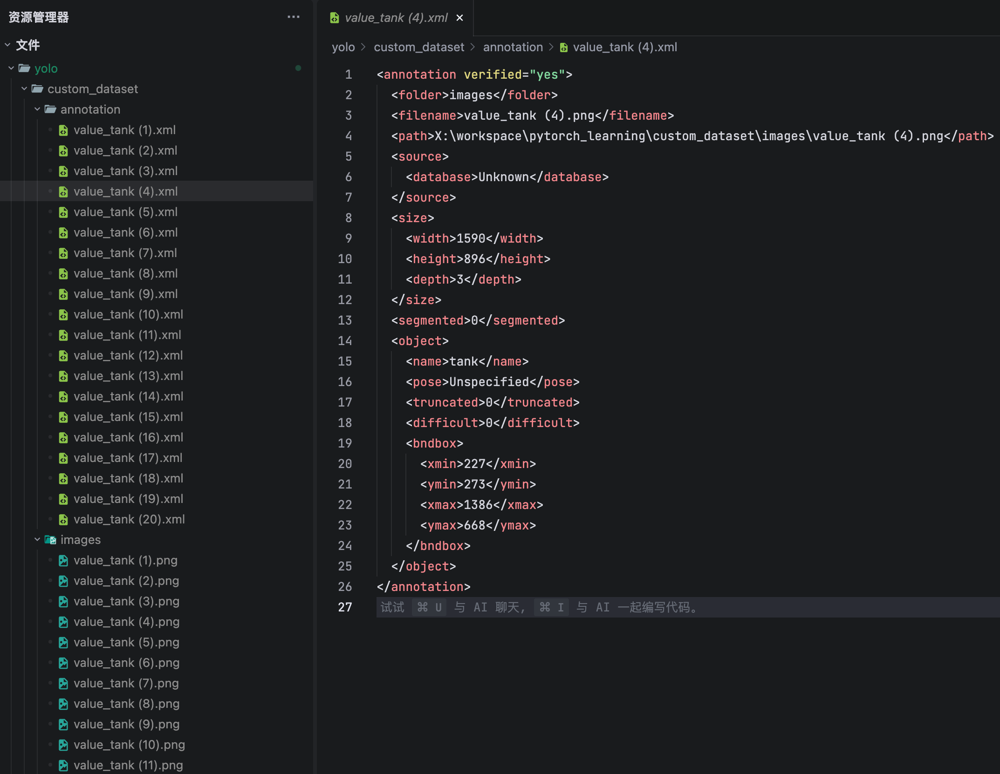
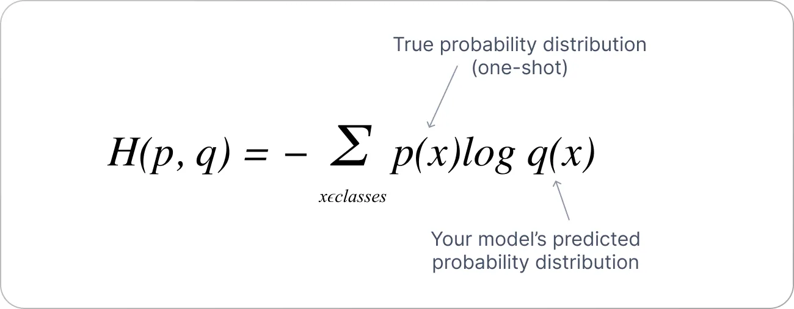

# 用 YOLO 训练自己的目标检测模型：从标注图片到识别“三角洲行动”目标

我用一小批自己标注的游戏截图，训练了一个可以识别“三角洲行动”目标的 YOLO 检测模型。

这件事听起来像是“深度学习工程师专属任务”，但真正跑通以后会发现，目标检测的完整流程其实非常清晰：

1. 准备图片。
2. 用工具把目标框出来。
3. 把标注整理成 YOLO 能读懂的格式。
4. 写一个数据集配置文件。
5. 加载预训练模型并开始训练。
6. 用训练出来的 `best.pt` 对新图片做预测。

这篇文章会尽量做到两件事：

- 对初学者友好：先讲“它在做什么”，再讲“代码怎么写”。
- 保留技术细节：数据格式、坐标转换、训练参数、评估指标都会解释清楚。

如果你从来没训练过目标检测模型，也可以把这篇文章当成一次完整的实战路线图。

---

## 1. 目标检测到底在做什么？

计算机视觉里有很多任务。最常见的几个可以简单区分为：

- **图像分类**：判断一张图里有什么，比如“这是一辆车”。
- **目标检测**：不仅判断有什么，还要把目标的位置框出来，比如“这里有一辆车，位置在这个矩形框里”。
- **图像分割**：进一步精确到像素级，把目标的轮廓抠出来。

本文做的是第二种：**目标检测**。

目标检测模型的输出通常包含三类信息：

| 输出 | 含义 |
| --- | --- |
| 类别 | 这个目标是什么，比如 `tank` |
| 置信度 | 模型有多确定，比如 `0.86` |
| 边界框 | 目标在图片中的位置，通常用矩形框表示 |

一句话总结：

> 目标检测不是只告诉你“图里有坦克”，而是告诉你“坦克在图里的哪个位置”。

---

## 2. 为什么用 YOLO？

YOLO 的全称是 **You Only Look Once**，直译过来就是“只看一眼”。

这个名字其实很形象：YOLO 的核心优势是速度快，适合做实时或准实时的目标检测任务。对于初学者来说，它还有一个非常重要的优点：生态成熟，调用简单。

本文使用 `ultralytics` 库来完成 YOLO 模型的加载、训练和推理。你不需要从零实现完整的检测网络，只需要先理解数据格式和训练流程，就可以把一个自定义检测任务跑起来。

本文示例使用本地的 `yolo26n.pt` 模型文件。如果你的环境中没有这个权重文件，也可以换成当前 `ultralytics` 支持的其他 nano 级模型权重。`n` 通常代表 nano，也就是体积更小、速度更快的版本，适合入门实验。

---

## 3. 环境准备

先安装需要用到的库：

```bash
pip install ultralytics --upgrade
pip install opencv-python
pip install xmltodict pyyaml
```

其中：

- `ultralytics`：负责 YOLO 模型的加载、训练和预测。
- `opencv-python`：用于常见图像处理。
- `xmltodict`：用于把 VOC 格式的 XML 标注解析成 Python 字典。
- `pyyaml`：用于生成 YOLO 训练需要的 `data.yaml`。

---

## 4. 先快速跑一次官方示例

在正式训练自己的数据集之前，建议先用官方预训练模型跑一次预测。这样可以先确认环境没有问题。

新建 `quick_start.py`：

```python
from ultralytics import YOLO

# 加载模型。第一次运行时，如果本地没有对应权重，可能会自动下载。
model = YOLO("yolo26n.pt")

# 对一张网络图片进行目标检测，并保存检测结果。
model.predict(
    source="https://ultralytics.com/images/bus.jpg",
    save=True,
)
```

运行后，你会在类似下面的目录中看到预测结果：

```text
runs/detect/predict
```

如果想指定保存目录，可以这样写：

```python
model.predict(
    source="https://ultralytics.com/images/bus.jpg",
    save=True,
    project="images",
    name="bus_demo",
)
```

这一步的意义不是训练模型，而是确认三件事：

1. Python 环境能正常加载 YOLO。
2. 模型权重能正常读取。
3. 图片预测和结果保存流程能跑通。

先让 demo 跑起来，后面排查自定义数据集时会轻松很多。

---

## 5. 实战目标：训练一个自己的检测模型

这次我想训练一个模型，让它检测“三角洲行动”截图里的目标，例如：

- `tank`
- `coffee_bean`
- `info_device`
- `quantum_memory`

也就是说，我希望模型看到一张游戏截图时，能自动判断里面有没有这些目标，并把它们框出来。

目标检测任务最关键的不是代码，而是数据。

模型之所以能学会“什么是坦克”，不是因为它天生理解坦克，而是因为我们给了它足够多这样的样本：

> 这张图里有一个 `tank`，它的位置在这个框里。

只要你理解了这句话，就理解了目标检测数据集的本质。

---

## 6. 目标检测数据集格式

目标检测数据集有很多常见格式，比如 COCO、VOC 和 YOLO。

它们的共同点是：都要记录每个目标的类别和矩形框位置。

不同点在于：矩形框的表示方法不一样。

### 6.1 COCO 格式

COCO 是目标检测领域非常常见的数据集格式，通常使用 JSON 文件保存标注。

COCO 的边界框通常表示为：

```text
x_min, y_min, width, height
```

也就是：

- 矩形框左上角的 x 坐标
- 矩形框左上角的 y 坐标
- 矩形框宽度
- 矩形框高度

常见目录结构类似这样：

```text
coco/
├── annotations/
│   ├── instances_train2017.json
│   └── instances_val2017.json
├── train2017/
│   ├── 000000000009.jpg
│   └── ...
└── val2017/
    ├── 000000000139.jpg
    └── ...
```

### 6.2 VOC 格式

VOC 也是非常经典的目标检测数据集格式，通常使用 XML 文件保存标注。

VOC 的边界框通常表示为：

```text
x_min, y_min, x_max, y_max
```

也就是：

- 左上角坐标
- 右下角坐标

常见目录结构类似这样：

```text
voc/
├── annotations/
│   ├── train/
│   └── val/
└── images/
    ├── train/
    └── val/
```

### 6.3 YOLO 格式

YOLO 的标注格式更轻量。

它通常是一张图片对应一个同名的 `.txt` 文件。例如：

```text
0001.jpg
0001.txt
```

每个 `.txt` 文件里，一行代表一个目标：

```text
class_id x_center y_center width height
```

注意：YOLO 中的坐标不是图片中的原始像素值，而是归一化后的比例值，范围在 `[0, 1]` 之间。

例如：

```text
0 0.512000 0.438000 0.220000 0.180000
```

可以理解为：

- `0`：类别 ID，对应 `tank`
- `0.512000`：目标中心点 x 坐标，占整张图宽度的 51.2%
- `0.438000`：目标中心点 y 坐标，占整张图高度的 43.8%
- `0.220000`：目标宽度，占整张图宽度的 22%
- `0.180000`：目标高度，占整张图高度的 18%

YOLO 常见的数据集结构如下：

```text
custom_dataset/
├── images/
│   ├── train/
│   └── val/
└── labels/
    ├── train/
    └── val/
```

图片和标签要一一对应：

```text
images/train/001.jpg
labels/train/001.txt
```

---

## 7. 用 LabelImg 标注图片

本文使用的是 **LabelImg**。它是一个经典的开源图片标注工具，优点是轻量、免费、容易上手，并且支持导出 VOC 和 YOLO 格式。



### 第一步：加载图片

打开 LabelImg 后：

1. 点击 **Open Dir**，选择图片所在文件夹。
2. 点击 **Change Save Dir**，选择标签文件保存目录。

建议把图片和标签分开放：

```text
custom_dataset/
├── images/
└── annotation/
```

如果你直接导出 YOLO 格式，也可以使用：

```text
custom_dataset/
├── images/
└── labels/
```

### 第二步：选择导出格式

LabelImg 左侧会有一个格式按钮，常见状态是：

- `PascalVOC`：导出 `.xml` 文件。
- `YOLO`：导出 `.txt` 文件。

如果你打算直接训练 YOLO，选择 `YOLO` 最省事。

如果你已经标注成了 VOC 格式，也没关系，后面可以用脚本转换成 YOLO 格式。

### 第三步：开始画框

常用快捷键：

| 快捷键 | 作用 |
| --- | --- |
| `W` | 创建矩形框 |
| `Ctrl + S` / `Command + S` | 保存标注 |
| `D` | 下一张图片 |
| `A` | 上一张图片 |

标注时要注意两点：

1. 框尽量贴合目标，不要大面积框到背景。
2. 同一类目标的名字要保持一致，例如不要一会儿写 `tank`，一会儿写 `Tank`。

类别名不一致，会让模型以为它们是不同类别。

---

## 8. 从 VOC 转成 YOLO 格式

我一开始标注出来的是 VOC 的 `.xml` 文件，所以需要把它转换成 YOLO 的 `.txt` 文件。

转换的核心是把：

```text
x_min, y_min, x_max, y_max
```

变成：

```text
x_center, y_center, width, height
```

并且全部除以图片宽高，归一化到 `[0, 1]`。

核心公式是：

```python
x_center = (xmin + xmax) / 2 / image_width
y_center = (ymin + ymax) / 2 / image_height
width = (xmax - xmin) / image_width
height = (ymax - ymin) / image_height
```

完整转换函数如下：

```python
import os

import xmltodict


def convert_voc_to_yolo(annotations_dir, labels_dir, classes):
    """
    将 VOC XML 格式的标注转换为 YOLO TXT 格式。

    annotations_dir: XML 标注文件目录
    labels_dir: 转换后的 TXT 标签保存目录
    classes: 类别名称列表，例如 ["tank", "coffee_bean"]
    """
    os.makedirs(labels_dir, exist_ok=True)

    xml_files = [f for f in os.listdir(annotations_dir) if f.endswith(".xml")]

    for xml_file in xml_files:
        xml_path = os.path.join(annotations_dir, xml_file)

        with open(xml_path, "r", encoding="utf-8") as f:
            data = xmltodict.parse(f.read())

        image_width = float(data["annotation"]["size"]["width"])
        image_height = float(data["annotation"]["size"]["height"])

        file_id = os.path.splitext(xml_file)[0]
        txt_path = os.path.join(labels_dir, f"{file_id}.txt")

        objects = data["annotation"].get("object", [])
        if isinstance(objects, dict):
            objects = [objects]

        yolo_lines = []

        for obj in objects:
            cls_name = obj["name"]
            if cls_name not in classes:
                continue

            cls_id = classes.index(cls_name)
            bndbox = obj["bndbox"]

            xmin = float(bndbox["xmin"])
            ymin = float(bndbox["ymin"])
            xmax = float(bndbox["xmax"])
            ymax = float(bndbox["ymax"])

            x_center = (xmin + xmax) / 2.0 / image_width
            y_center = (ymin + ymax) / 2.0 / image_height
            width = (xmax - xmin) / image_width
            height = (ymax - ymin) / image_height

            yolo_lines.append(
                f"{cls_id} {x_center:.6f} {y_center:.6f} {width:.6f} {height:.6f}"
            )

        with open(txt_path, "w", encoding="utf-8") as f:
            f.write("\n".join(yolo_lines))
```

假设类别如下：

```python
classes = ["tank", "coffee_bean", "info_device", "quantum_memory"]
```

那么：

- `tank` 的类别 ID 是 `0`
- `coffee_bean` 的类别 ID 是 `1`
- `info_device` 的类别 ID 是 `2`
- `quantum_memory` 的类别 ID 是 `3`

这里有一个很重要的细节：**类别顺序必须和训练配置里的 `names` 保持一致**。

---

## 9. 编写 YOLO 数据集配置文件

YOLO 训练时需要一个 `data.yaml`，用来告诉模型：

- 数据集根目录在哪里。
- 训练图片在哪里。
- 验证图片在哪里。
- 一共有多少类别，每个类别叫什么。

推荐的正式结构是：

```text
custom_dataset/
├── data.yaml
├── images/
│   ├── train/
│   └── val/
└── labels/
    ├── train/
    └── val/
```

对应的 `data.yaml` 可以这样写：

```yaml
path: /Users/bytedance/workspace/pytorch_learning/yolo/custom_dataset
train: images/train
val: images/val

names:
  0: tank
  1: coffee_bean
  2: info_device
  3: quantum_memory
```

如果你只是为了快速跑通流程，暂时没有划分训练集和验证集，也可以让训练和验证使用同一批图片：

```yaml
path: /Users/bytedance/workspace/pytorch_learning/yolo/custom_dataset
train: images
val: images

names:
  0: tank
  1: coffee_bean
  2: info_device
  3: quantum_memory
```

但要注意：这只是演示写法。

如果训练集和验证集是同一批图片，验证指标会偏乐观。模型可能只是记住了这些图片，而不是真的学会了泛化到新截图。

正式训练时，建议至少拆成：

- 80% 图片作为训练集。
- 20% 图片作为验证集。

---

## 10. 开始训练

训练代码可以很短：

```python
from ultralytics import YOLO

model = YOLO("yolo26n.pt")

results = model.train(
    data="custom_dataset/data.yaml",
    epochs=100,
    imgsz=640,
    batch=4,
    project="train_results",
    name="custom_train",
)
```

这些参数分别表示：

| 参数 | 含义 | 怎么理解 |
| --- | --- | --- |
| `data` | 数据集配置文件路径 | 告诉 YOLO 去哪里找图片和标签 |
| `epochs` | 训练轮数 | 模型把全部训练数据看多少遍 |
| `imgsz` | 输入图片尺寸 | 训练前会把图片缩放到这个尺寸附近 |
| `batch` | 批次大小 | 一次喂给模型多少张图片 |
| `project` | 输出目录 | 保存训练结果 |
| `name` | 实验名称 | 区分不同训练实验 |

如果你是 Mac，并且 PyTorch 支持 MPS，也可以尝试指定：

```python
results = model.train(
    data="custom_dataset/data.yaml",
    epochs=100,
    imgsz=640,
    batch=4,
    device="mps",
)
```

如果你有 NVIDIA GPU，可以尝试：

```python
results = model.train(
    data="custom_dataset/data.yaml",
    epochs=100,
    imgsz=640,
    batch=4,
    device=0,
)
```

如果显存不够，优先调小 `batch`。比如从 `4` 改成 `2`，甚至改成 `1`。

---

## 11. 训练结果保存在哪里？

训练完成后，通常会生成类似这样的目录：

```text
train_results/
└── custom_train/
    ├── weights/
    │   ├── best.pt
    │   └── last.pt
    ├── results.csv
    └── ...
```

其中最重要的是：

- `best.pt`：验证集指标最好的模型权重，通常用于最终预测。
- `last.pt`：最后一轮训练结束时的模型权重。
- `results.csv`：每一轮训练的损失和指标。

一般情况下，我们会优先使用：

```text
train_results/custom_train/weights/best.pt
```

---

## 12. 如何看懂 results.csv？

训练结束后，`results.csv` 会记录每个 epoch 的表现。

下面是一个训练前 5 轮的示例：

| epoch | time | train/box_loss | train/cls_loss | train/dfl_loss | metrics/precision(B) | metrics/recall(B) | metrics/mAP50(B) | metrics/mAP50-95(B) | val/box_loss | val/cls_loss | val/dfl_loss | lr/pg0 | lr/pg1 | lr/pg2 |
| :--- | :--- | :--- | :--- | :--- | :--- | :--- | :--- | :--- | :--- | :--- | :--- | :--- | :--- | :--- |
| 1 | 13.3459 | 1.32585 | 11.2315 | 0.02093 | 0.02818 | 0.66667 | 0.03989 | 0.01135 | 1.12445 | 16.8487 | 0.02813 | 5e-05 | 5e-05 | 5e-05 |
| 2 | 25.5511 | 1.41282 | 13.9945 | 0.03049 | 0.03443 | 0.67708 | 0.19294 | 0.05718 | 0.86359 | 16.2138 | 0.02145 | 0.000111386 | 0.000111386 | 0.000111386 |
| 3 | 37.1597 | 1.18026 | 13.2446 | 0.02545 | 0.02972 | 0.69792 | 0.09421 | 0.03176 | 0.79439 | 16.0474 | 0.02013 | 0.000171535 | 0.000171535 | 0.000171535 |
| 4 | 49.3252 | 0.94532 | 11.0331 | 0.01499 | 0.01483 | 0.71875 | 0.08517 | 0.03963 | 0.79102 | 15.9954 | 0.01846 | 0.000230446 | 0.000230446 | 0.000230446 |
| 5 | 61.7327 | 0.9305 | 10.5206 | 0.0189 | 0.00965 | 0.47917 | 0.08202 | 0.04612 | 0.77071 | 15.8946 | 0.01763 | 0.00028812 | 0.00028812 | 0.00028812 |

第一次看到这个表，可能会有点密集。其实可以先抓住两个方向：

- Loss 越低越好。
- Metrics 越高越好。

### 12.1 训练损失：模型在练习题上错得多不多

训练损失看的是模型在训练集上的表现。

| 指标 | 含义 | 通俗解释 |
| --- | --- | --- |
| `train/box_loss` | 框的位置误差 | 模型画的框和真实框差多少 |
| `train/cls_loss` | 类别判断误差 | 模型有没有把类别认错 |
| `train/dfl_loss` | 边界框细化误差 | 帮助模型把框的位置调得更精细 |

这些值通常越低越好。

如果训练过程中 loss 一直下降，说明模型正在学习训练集里的规律。

### 12.2 验证指标：模型在模拟考试上表现如何

验证指标看的是模型在验证集上的表现。

| 指标 | 含义 | 通俗解释 |
| --- | --- | --- |
| `metrics/precision(B)` | 精确率 | 模型框出来的目标里，有多少是真的 |
| `metrics/recall(B)` | 召回率 | 真实存在的目标里，模型找到了多少 |
| `metrics/mAP50(B)` | 宽松标准下的综合分 | 框和真实框重叠超过 50% 就算比较合格 |
| `metrics/mAP50-95(B)` | 更严格的综合分 | 从宽松到严格多个标准一起平均 |

精确率和召回率可以这样理解：

- 精确率高：模型比较谨慎，框出来的大多是对的。
- 召回率高：模型比较积极，尽量不漏掉目标。

`mAP50` 是很多目标检测任务里最常被关注的指标之一。它越高，通常说明模型检测效果越好。

`mAP50-95` 更严格，它不仅要求找到目标，还要求框的位置更准。

### 12.3 什么时候说明过拟合了？

过拟合可以简单理解为：

> 模型把练习题背熟了，但换一道新题就不会了。

在训练曲线上，它常见的表现是：

- `train loss` 继续下降。
- `val loss` 不降反升。
- 验证集指标不再提升，甚至开始变差。

如果出现这种情况，可以考虑：

1. 增加数据量。
2. 做数据增强。
3. 减少训练轮数。
4. 使用更小的模型。
5. 重新检查标注质量。

---

## 13. 使用训练好的模型预测

训练完成后，就可以加载 `best.pt` 做预测。

新建 `predict_custom.py`：

```python
import os

from ultralytics import YOLO


model = YOLO("train_results/custom_train/weights/best.pt")

# 如果你已经拆分了 train/val，可以把这里改成 custom_dataset/images/val。
# 如果你像本文演示一样暂时使用扁平目录，就保持 custom_dataset/images。
test_image_dir = "custom_dataset/images"
image_paths = [
    os.path.join(test_image_dir, filename)
    for filename in os.listdir(test_image_dir)
    if filename.lower().endswith((".jpg", ".jpeg", ".png", ".bmp"))
]

model.predict(
    source=image_paths,
    save=True,
    conf=0.3,
    project="train_results",
    name="custom_predict",
)
```

这里的 `conf=0.3` 是置信度阈值。

它的意思是：如果模型对某个检测框的信心低于 0.3，就不显示这个框。

如果你发现模型漏检比较多，可以适当降低 `conf`。

如果你发现模型误检比较多，可以适当提高 `conf`。

---

## 14. 如果只用 20 张图片，效果靠谱吗？

这要看你的目标是什么。

如果目标是学习完整流程，20 张图片足够跑通：

- 标注。
- 转格式。
- 写配置。
- 训练。
- 预测。
- 看指标。

但如果目标是做一个稳定可用的检测器，20 张图片通常是不够的。

原因很简单：模型见过的情况太少。

真实场景里，同一个目标可能会有很多变化：

- 角度不同。
- 亮度不同。
- 大小不同。
- 背景不同。
- 遮挡不同。
- 截图清晰度不同。

数据太少时，模型可能只记住了训练图片的特征，而没有学会真正泛化。

所以这类小数据集实验更适合理解流程。想要提升效果，优先考虑这几个方向：

1. 增加图片数量。
2. 增加场景多样性。
3. 检查标注是否准确。
4. 合理划分训练集和验证集。
5. 对容易混淆的类别补充更多样本。

---

## 15. 自己实现一个目标检测模型会有多难？

前面我们使用的是成熟的 YOLO 工具链。它帮我们封装了大量细节。

如果要自己从零实现一个目标检测模型，首先至少要处理两个核心问题：

1. 设计网络结构。
2. 设计损失函数。

### 15.1 输入和输出

目标检测模型的输入是一张图片。

输出则要同时回答两个问题：

- 定位：目标在哪里？
- 分类：目标是什么？

一个简化后的输出可以理解为：

`[center_x, center_y, width, height, class_score_1, class_score_2, class_score_3, class_score_4]`

例子如下：

```bash
| Target | centerX | centerY | width | height | Class1 | Class2 | Class3 | Class4 |
| --- | --- | --- | --- | --- | --- | --- | --- | --- |
| 坦克 | 0.5 | 0.5 | 0.2 | 0.3 | 1.8 | -2.5 | 0.2 | -0.2 |
```

这里可以分成两部分：

- `centerX, centerY, width, height`：负责描述位置。
- `Class1, Class2, Class3, Class4`：负责描述类别。

位置预测本质上更像回归问题。

类别预测本质上更像分类问题。

所以目标检测难就难在：它不是单一任务，而是“定位 + 分类”的组合任务。

### 15.2 坐标损失

对于框的位置，我们希望预测框越接近真实框越好。

如果只是做一个非常简化的模型，可以先用 MSE 这类回归损失来理解：

```text
预测框坐标和真实框坐标越接近，损失越小。
```

但真实目标检测模型通常会使用更复杂的框回归损失，因为它要考虑框的重叠面积、中心点距离、宽高比例等因素。

### 15.3 分类损失

对于类别，我们希望模型把正确类别的分数变高，把错误类别的分数变低。

模型直接输出的通常不是概率，而是 logits。

例如：

```text
[1.8, -2.5, 0.2, -0.2]
```

这些数字经过 softmax 后，会变成概率分布：

```text
[0.74, 0.01, 0.15, 0.10]
```

也就是说，模型认为第一个类别的概率最高。



分类任务中常见的损失函数是 `CrossEntropyLoss`。它会惩罚错误分类，并鼓励模型把正确类别的概率推高。

因此在这次实现中，我们的损失函数就是：**总损失 = 坐标损失 + 分类损失**

也就是：

`loss = bbox_loss + class_loss`


### 15.4 网络模型的设计

明确了输入和输出，以及损失函数的设计后，剩下的就是如何去设计网络模型了。

在一个模型网络中，我们可以根据功能来将网络分成不同的部分。以目标检测为例，功能一共可以分为：

```text
                                                     ┌──────────────┐
                                                ┌──▶ │  class_head  │
┌────────┐    ┌──────────┐    ┌──────────────┐  │    │   预测类别    │
│ 输入图片 │──▶│ Backbone │──▶ │ Pool + Shared│ ─┬┘   └──────────────┘
│        │    │ 提取特征  │    │  压缩整理特征  │  │
└────────┘    └──────────┘    └──────────────┘  │      ┌──────────────┐
                                                └────▶ │  bbox_head   │
                                                       │   预测边框    │
                                                       └──────────────┘
```

#### 15.4.1 Backbone：提取图像特征

首先需要实现 Backbone 部分。Backbone 可以理解为模型的“眼睛”：它不直接负责输出最终类别和边界框，而是先把原始图片转换成更抽象的特征。

比如一张原始图片里只有 RGB 像素值，模型一开始并不知道哪里是边缘、哪里是纹理、哪里像履带、哪里像炮塔。Backbone 要做的事情，就是通过一层层卷积把这些低级像素逐步提炼成更有语义的信息。

为了先理解流程，下面采用简单的多层卷积+池化网络结构来提取图像特征：

```python
class MyYolo(nn.Module):
    def __init__(self):
        super().__init__()
        self.backbone = nn.Sequential(
            nn.Conv2d(3, 32, kernel_size=3, padding=1),
            nn.ReLU(),
            nn.MaxPool2d(kernel_size=2),
            # 第二层卷积：通道从 32 -> 64
            nn.Conv2d(32, 64, kernel_size=3, padding=1),
            nn.ReLU(),
            nn.MaxPool2d(kernel_size=2),
            # 第三层卷积：通道从 64 -> 128
            nn.Conv2d(64, 128, kernel_size=3, padding=1),
            nn.ReLU(),
            nn.MaxPool2d(kernel_size=2),
            # 第四层卷积：通道从 128 -> 256
            nn.Conv2d(128, 256, kernel_size=3, padding=1),
            nn.ReLU(),
            nn.MaxPool2d(kernel_size=2),
        )
        self.share = nn.Sequential(
            nn.Flatten(),
            # 假设图片都是 64*64，所以最终会变成 4*4 大小
            nn.Linear(256 * 4 * 4, 1024),
            nn.ReLU(),
        )

    def forward(self, x):
        x = self.backbone(x)
        x = self.share(x)
        return x
```

这个写法的优点是结构简单，适合用来理解“卷积提特征、池化压缩尺寸、全连接层整理特征”的基本过程。

但它也有一个明显问题：这个 Backbone 是从零开始训练的。对于只有几十张或者几百张图片的小数据集来说，模型很难学到足够稳定的图像特征。它可能还没真正理解“坦克长什么样”，就已经把训练集里的几张截图背下来了。

所以如果想让效果更好，一个常见做法是：**不要完全从零设计 Backbone，而是使用已有的成熟模型结构作为特征提取器**。

例如可以使用 VGG、ResNet、MobileNet 这类已经在大规模图像数据上训练过的网络。它们前面的卷积层已经学到了一些通用视觉特征，比如：

- 边缘和角点。
- 颜色和纹理。
- 局部形状。
- 更高层的物体部件特征。

这类通用特征不只对 ImageNet 分类任务有用，对自己的小型目标检测任务也有帮助。我们可以把这些成熟网络当作 Backbone，后面再接自己的 `class_head` 和 `bbox_head`。

用 VGG16 做 Backbone 的简化示例如下：

```python
import torch.nn as nn
from torchvision.models import VGG16_Weights, vgg16


class MyYoloWithVGG(nn.Module):
    def __init__(self):
        super().__init__()

        # 加载在 ImageNet 上预训练过的 VGG16。
        vgg = vgg16(weights=VGG16_Weights.DEFAULT)

        # VGG 的 features 部分主要由卷积层和池化层组成，适合作为 Backbone。
        self.backbone = vgg.features

        # 用自适应池化把不同输入尺寸的特征图统一压缩到固定大小。
        self.pool = nn.AdaptiveAvgPool2d((7, 7))

        # VGG16 features 的输出通道数是 512。
        self.share = nn.Sequential(
            nn.Flatten(),
            nn.Linear(512 * 7 * 7, 1024),
            nn.ReLU(),
        )

    def forward(self, x):
        x = self.backbone(x)
        x = self.pool(x)
        x = self.share(x)
        return x
```

这段代码里最关键的是：

```python
self.backbone = vgg.features
```

因为 VGG16 可以分成两大部分：

- `features`：前面的卷积网络，负责提取图像特征。
- `classifier`：后面的分类器，负责 ImageNet 的 1000 类分类。

我们做目标检测时，并不需要 VGG 原本的 1000 类分类器，所以只保留 `features` 作为 Backbone，然后把后面的预测头换成自己的结构。

可以把这理解成两种训练方式：

| 方式 | 含义 | 适合场景 |
| --- | --- | --- |
| 从零训练 Backbone | 所有特征都让模型自己学 | 数据量比较大，算力充足 |
| 使用预训练 Backbone | 复用成熟模型学过的视觉特征 | 数据量较小，希望更快得到可用效果 |


### 15.5 DataLoader 实现


---

## 16. 这次实战我最大的收获

目标检测刚开始看起来很复杂，因为它同时涉及图片、标注、坐标、模型、训练指标和推理结果。

但把流程拆开以后，它其实是一条很清晰的链路：

```text
图片 -> 标注 -> 标签格式 -> data.yaml -> 训练 -> best.pt -> 预测结果
```

我觉得最重要的不是记住某个参数怎么写，而是理解这几件事：

1. 模型不是凭空“认识”目标的，它是从标注数据里学出来的。
2. YOLO 标签里的坐标是归一化比例，不是原始像素。
3. 训练指标不能只看训练集，还要看验证集。
4. 小数据集可以帮助你跑通流程，但不能代表模型真的足够稳。
5. 先调通工具链，再深入理解模型原理，是更适合初学者的路径。

如果你也想做自己的目标检测项目，可以先不要追求一步到位。

先准备十几张图片，手动标注，训练一个非常小的模型，让它能在你的图片里框出目标。

当你第一次看到模型把自己关心的东西框出来时，整个目标检测流程就会突然变得具体起来。
